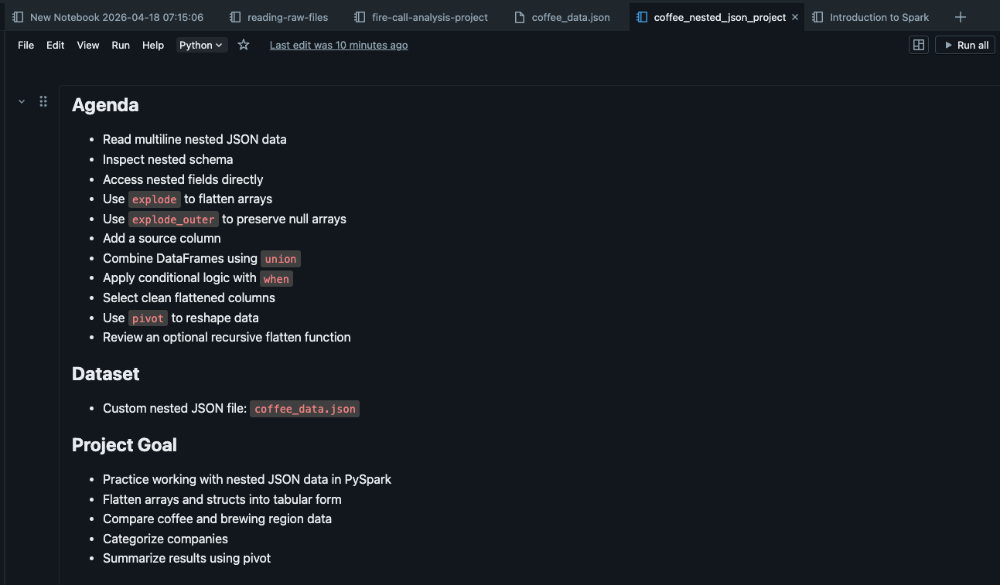
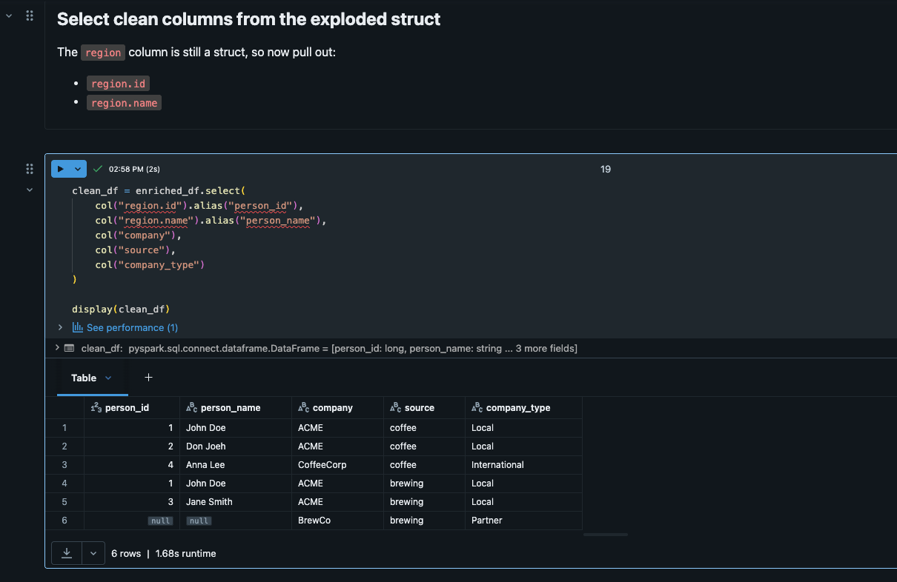
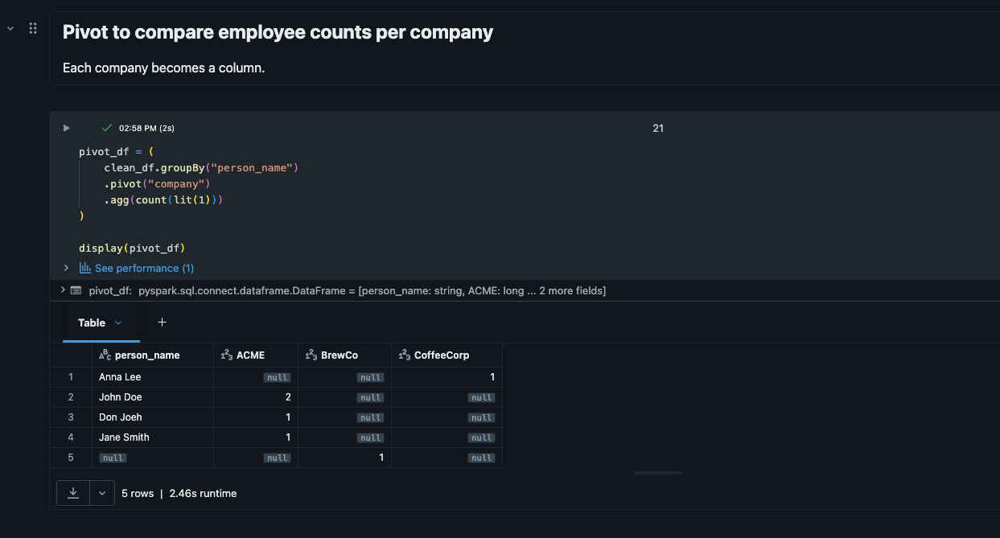

# Databricks Nested JSON Coffee Analysis

## Overview

This is a beginner Databricks + PySpark project built to practice working with nested JSON data.

The project reads a multiline JSON file, flattens nested structures, uses explode and explode_outer for arrays, combines datasets with union, applies conditional logic with when, and reshapes data with pivot.

---

## Tools & Technologies

* Databricks
* PySpark
* JSON
* Python

---

## Dataset

* Custom nested JSON file: `coffee_data.json`
* Stored in a Databricks Volume

---

## Data Pipeline Flow

1. Read multiline nested JSON
2. Inspect schema
3. Explode nested arrays
4. Select nested struct fields
5. Union coffee and brewing datasets
6. Enrich with conditional logic
7. Pivot results for comparison

---

## Key Concepts Practiced

### 1. Reading Nested JSON

Used Spark to read a multiline JSON file with nested structs and arrays.

### 2. Exploding Arrays

Used explode() and explode_outer() to convert arrays into rows.

### 3. Accessing Nested Fields

Used dot notation to select fields from nested structs.

### 4. Combining DataFrames

Used union() to combine coffee and brewing datasets.

### 5. Conditional Logic

Used when() to create a categorized company type column.

### 6. Reshaping Data

Used pivot() to compare counts by company.

---

## Screenshots

### Project Overview

### Clean Exploded Output

### Pivot Output

---

## Project Structure

databricks-nested-json-coffee-analysis/
├── README.md
├── notebooks/
│   └── coffee_nested_json_analysis.py
└── images/
├── coffee_project_overview.png
├── coffee_clean_output.png
└── coffee_pivot_output.png

---

## What I Learned

In this project, I learned how nested JSON data appears in Spark, how to flatten arrays into rows with explode, how to preserve null arrays using explode_outer, how to combine DataFrames using union, and how to reshape data using pivot.

I also reinforced that nested JSON workflows typically follow this pattern:

read → inspect schema → explode → select nested fields → transform → aggregate → reshape

---

## Future Improvements

* Add explicit schema instead of relying on inference
* Use larger and more complex nested datasets
* Write output to Parquet or a managed table
* Add more analytical queries on the flattened data
